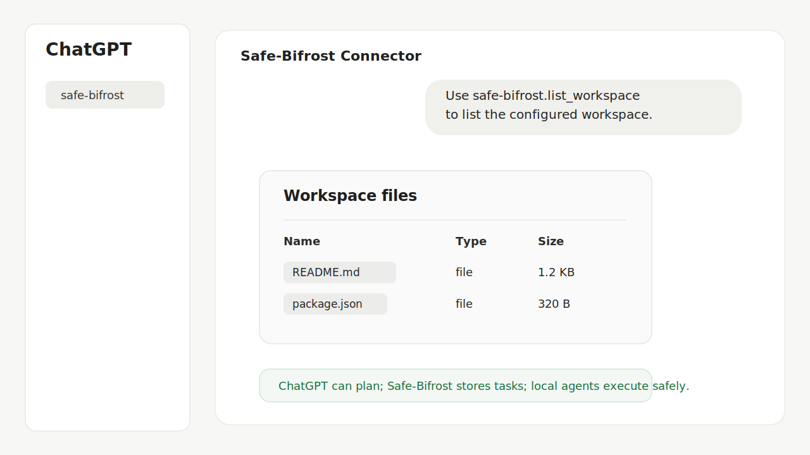

# Safe-Bifrost

Safe-Bifrost is a local Model Context Protocol (MCP) bridge for safe
plan-and-execute coding workflows.

It lets ChatGPT, Codex, Claude, or another MCP client save a plan, create a
workspace-scoped task, let a local agent execute it, and then read back the
result, git diff, test log, and task status.



## Why

Many local coding bridges give the upstream model broad shell access.
Safe-Bifrost takes a narrower route:

```text
ChatGPT Web or another MCP client
-> Safe-Bifrost MCP tools
-> save_plan / create_task
-> watcher finds pending tasks
-> local agent executes
-> result.md / git.diff / test.log / status.json
-> client reviews the result
```

The MCP client can plan and review, but it does not receive a general shell
tool.

## Features

- MCP stdio server with workspace-scoped tools.
- Optional HTTP MCP server bound to `127.0.0.1`.
- ChatGPT Connector / OpenAI Secure MCP Tunnel workflow.
- Automatic watcher for pending tasks.
- Local runner that captures `result.md`, `git.diff`, `test.log`, and
  `status.json`.
- File reads contained to one configured `workspaceRoot`.
- Sensitive file blocking for `.env`, tokens, SSH keys, credentials, cookies,
  and similar paths.
- Agent command allowlist through `safe-bifrost.config.json`.
- Test command exact-match allowlist.
- Windows-friendly helper scripts.
- Read-only `doctor` command for local setup diagnostics.

## MCP Tools

Safe-Bifrost exposes these tools:

- `list_workspace`
- `read_workspace_file`
- `save_plan`
- `get_plan`
- `create_task`
- `get_task_status`
- `get_result`
- `get_diff`
- `get_test_log`

## Install

Requirements:

- Node.js 18 or newer
- npm
- Git, if you want `git.diff`
- A configured local coding agent such as `opencode` or `codex`

Windows PowerShell:

```powershell
cd path\to\safe-bifrost
npm.cmd ci
npm.cmd run build
npm.cmd test
```

Linux, macOS, or WSL:

```bash
cd safe-bifrost
npm ci
npm run build
npm test
```

## Configure

Create `safe-bifrost.config.json` in the project root. Do not commit this
file.

```json
{
  "workspaceRoot": "D:/path/to/test-or-project-workspace",
  "plansDir": ".safe-bifrost/plans",
  "tasksDir": ".safe-bifrost/tasks",
  "agents": {
    "opencode": {
      "command": "opencode",
      "args": ["run", "{prompt}"]
    }
  },
  "allowedTestCommands": ["npm test"],
  "maxReadFileBytes": 200000,
  "httpPort": 7331
}
```

Important rules:

- Use a small project directory for `workspaceRoot`.
- Do not set `workspaceRoot` to a drive root, home directory, Desktop,
  Downloads, or Documents.
- Do not place secrets inside the workspace.
- Keep agent commands and test commands narrow.

## Run Locally

Build first:

```powershell
npm.cmd run build
```

Run the stdio MCP server:

```powershell
$env:SAFE_BIFROST_CONFIG = "path\to\safe-bifrost.config.json"
node dist\index.js
```

Run the watcher in another terminal:

```powershell
$env:SAFE_BIFROST_CONFIG = "path\to\safe-bifrost.config.json"
npm.cmd run watch
```

Run the HTTP MCP server for local tunnel mode:

```powershell
$env:SAFE_BIFROST_CONFIG = "path\to\safe-bifrost.config.json"
npm.cmd run start:http
```

The HTTP server binds only to `127.0.0.1`.

## ChatGPT Connector

The intended ChatGPT flow is:

```text
ChatGPT Web
-> ChatGPT Connector
-> OpenAI Secure MCP Tunnel
-> Safe-Bifrost MCP server
-> watcher
-> local agent
```

For stdio tunnel mode on Windows, use the launcher:

```text
scripts/safe-bifrost-mcp-stdio.cmd
```

This wrapper sets `SAFE_BIFROST_CONFIG`, changes into the Safe-Bifrost project
root, and starts `node dist/index.js`. It prevents tunnel-client from using
the tunnel-client directory as the MCP workspace.

### One-Click Windows Launcher

For local development, run:

```text
Start-SafeBifrost-Tunnel.cmd
```

The launcher:

- asks for your tunnel runtime API key without saving it to disk
- asks for a tunnel ID if `SAFE_BIFROST_TUNNEL_ID` is not already set
- starts the watcher in a separate PowerShell window
- runs `tunnel-client doctor`
- starts `tunnel-client run`

Optional environment variables:

```powershell
$env:SAFE_BIFROST_TUNNEL_ID = "tunnel_xxx"
$env:TUNNEL_CLIENT_EXE = "C:\path\to\tunnel-client.exe"
$env:OPENCODE_BIN_DIR = "C:\path\to\opencode-ai\bin"
$env:HTTPS_PROXY = "http://127.0.0.1:7892"
```

Never commit API keys, runtime keys, tunnel IDs, local account names, or
private workspace IDs.

## Demo

See [docs/demo.md](docs/demo.md) for a privacy-safe ChatGPT connector demo and
expected outputs.

## Troubleshooting

### ChatGPT lists the tunnel-client directory

If `list_workspace` returns only `tunnel-client.exe`, the MCP child process did
not receive `SAFE_BIFROST_CONFIG` or started from the wrong working directory.

Fix: use `scripts/safe-bifrost-mcp-stdio.cmd` as the tunnel MCP command, then
restart tunnel-client.

### ChatGPT tool call times out

Check the tunnel-client UI at:

```text
http://127.0.0.1:8080/ui
```

If logs show:

```text
unsupported_country_region_territory
403 Forbidden
```

then the current proxy exit region is not supported by the OpenAI API control
plane. Change to a supported region and restart tunnel-client.

If logs show direct connection timeouts to `api.openai.com`, set a proxy:

```powershell
$env:HTTPS_PROXY = "http://127.0.0.1:7892"
```

### ChatGPT Connector creation fails

Verify:

- tunnel-client is running
- the tunnel is associated with the correct ChatGPT workspace
- the connector uses `Channel`, not `Server URL`
- authentication is set to `None` unless you have implemented OAuth
- browser translation extensions are disabled on Platform pages

## Security Model

Safe-Bifrost intentionally avoids general shell execution through MCP tools.

- MCP clients cannot pass arbitrary shell commands.
- Agent commands must be configured ahead of time.
- Test commands must match `allowedTestCommands` exactly.
- File reads are contained to `workspaceRoot`.
- Sensitive file names are blocked even inside the workspace.
- The runner does not commit, push, delete files, or reset repositories.
- HTTP mode binds to `127.0.0.1` only.

This is still a local automation bridge. Treat connector access as powerful
and use a dedicated test workspace first.

## Development

Windows PowerShell:

```powershell
npm.cmd run build
npm.cmd test
npm.cmd run test:mcp
npm.cmd run test:http-mcp
npm.cmd run doctor
npm.cmd run pack:clean
```

Package checks:

```powershell
npm.cmd run verify:package
npm.cmd run pack:clean
```

The clean archive excludes:

- `node_modules/`
- `.safe-bifrost/`
- `*.log`
- `.env`
- `safe-bifrost.config.json`
- local release artifacts

## Roadmap

- [x] stdio MCP server
- [x] plan and task CRUD
- [x] runner and watcher
- [x] HTTP MCP server
- [x] ChatGPT Connector tunnel docs
- [x] doctor command
- [ ] worktree isolation
- [ ] multi-agent task queue
- [ ] dashboard

## License

MIT
